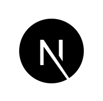

<h1 style="margin-bottom: 2px">RABBIL HASAN</h1>
 
Senior Software Engineer 
  

  
  
  

### Love to code

  
  
  
  
  
  
  
  
  
  
  
  
  
  

### Favourite Tools

### About
I am “Rabbil Hasan” the leading popular face among Bangladeshi programmers community. I am working on web & mobile application development more than 8 years. Research & development, teaching, community leading is the top most noticeable skill inside me.

### Working Area

1. Stock Market Trading, Online Deposit , Mutual Fund Investment system
2. Electronic Know Your Customer (e-KYC)
3. Core Solutions for Stock Exchange Brokerage.
4. Third Party Business Partner Management (TPBP)
5. Online Credit Appraisal System
6. Investment Banking, Corporate Finance, Consumer Banking
7. Payment System Design B2B & B2C

###  Completed R&D Past Years:

1. Best practices for Restful API & mobile application development.
2. Best practices for single page web application development.
3. Cross platform install-able PWA development.
5. Bio-metric face analysis & recognition using TensorFlow
6. Optical character recognition using Tesseract engine
7. High performance & reusable JavaScript component development.
8. Web application optimization to reduce server load.
9. Web security practices

<table>
<tbody>

<tr style="margin: 0 ;padding: 2px ;border: none">
<td style="margin: 0 ;padding: 2px ;border: none">

 

</td >

<td style="margin: 0 ;padding: 2px ;border: none" >

 

</td>
</tr>

</tbody>
</table>

###  Open Source Contribution Going:

<table>
<tbody>
<tr style="margin: 0 ;padding: 2px ;border: none">
<td style="margin: 0 ;padding: 2px ;border: none">

</td>

<td style="margin: 0 ;padding: 2px ;border: none">

</td>
</tr>

<tr style="margin: 0 ;padding: 2px ;border: none">
<td style="margin: 0 ;padding: 2px ;border: none">

</td>

<td style="margin: 0 ;padding: 2px ;border: none">

</td>
</tr>

</tbody>

</table>

